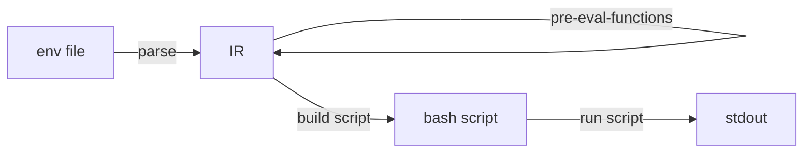
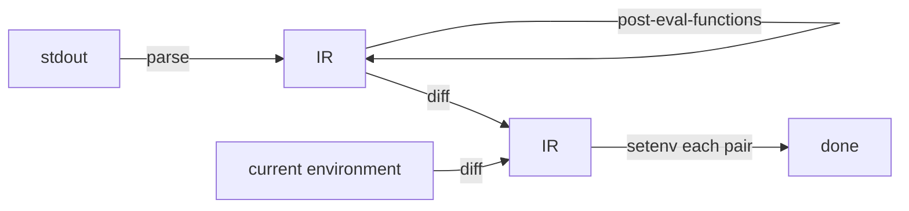

# environ

An Emacs package that provides some helpful functions for working with
environment variables and env files.

This package uses a bash subprocess to fully expand variables, which means you can leverage the power of bash to define variables.

## Table of Contents

- [Installation](#installation)
- [Example Usage](#example-usage)
- [API](#api)
  - [environ-set-file `(file-path)`](#environ-set-file-file-path)
  - [environ-unset-file `(file-path)`](#environ-unset-file-file-path)
  - [environ-set-str `(str)`](#environ-set-str-str)
  - [environ-unset-str `(str)`](#environ-unset-str-str)
  - [environ-get-pairs](#environ-get-pairs)
  - [environ-set-pairs `(pairs)`](#environ-set-pairs-pairs)
  - [environ-unset-pairs `(pairs)`](#environ-unset-pairs-pairs)
  - [environ-get-names](#environ-get-names)
  - [environ-unset-names `(names)`](#environ-unset-names-names)
  - [environ-unset-name `(name)`](#environ-unset-name-name)
- [Configuration](#configuration)
- [File Format](#file-format)
- [Usage from org-mode](#usage-from-org-mode)
- [How it Works](#how-it-works)
- [See Also](#see-also)

## Installation

This package is currently not available in a package archive, so for now, you
need to install from source. This can be achieved easily with e.g. [straight][],
[elpaca][], or [package-vc-install][].

For example, using elpaca:

```emacs-lisp
(use-package env
  :elpaca (env
           :host github
           :repo "cfclrk/env")
  :config
  (setq environ-dir (expand-file-name "~/.env/")))
```

[straight]: https://github.com/radian-software/straight.el
[elpaca]: https://github.com/progfolio/elpaca
[package-vc-install]: https://emacsredux.com/blog/2023/03/12/install-a-package-from-a-vcs-repository/

## Example Usage

Create an env file with the following contents at `~/.env/foo`:

```sh
FOO=~/foo
BAR=$FOO/bar
BAZ=$(pwd)
```

Now, run `M-x environ-set-file`, which will prompt for a file. Navigate to
`~/.env/foo` and press Enter. Voilà, you have three new environment variables
set in Emacs. Verify you can retrieve them with `M-x getenv`. Unset them with
`M-x environ-unset-file` (this will again prompt for a file).

Besides setting (and unsetting) environment variables from env files, this
package provides an API for common operations with environment variables.
Examples below.

## API

### environ-set-file `(file-path)`

**[interactive]** Set environment variables defined in the file at FILE-PATH.

When used interactively, prompts for the file to load. The prompt begins in
`environ-dir`. When used from elisp, FILE-PATH can either be absolute or
relative to `default-directory`.

```emacs-lisp
(environ-set-file
  (expand-file-name "~/.env/foo"))
```

### environ-unset-file `(file-path)`

**[interactive]** Unset the environment variables defined in FILE-PATH.

See the documentation for `environ-set-file`.

```emacs-lisp
(environ-unset-file
 (expand-file-name "~/.env/foo"))
```

### environ-set-str `(str)`

Set environment variables defined in the given string STR.

Parse STR like an env file. STR is split into newline-delimited lines, where
each line is a key/value pair.

```emacs-lisp
(environ-set-str "FOO=foo\nBAR=bar")
(getenv "FOO") ;; => "foo"
(getenv "BAR") ;; => "bar"
```

### environ-unset-str `(str)`

Unset environment variables defined in string STR.

Parse STR like an env file. STR is split into newline-delimited pairs, where the
key of each pair is the environment variable name. The value of each pair is
discarded, as the environment variable will be unset regardless of its value.

```emacs-lisp
(environ-unset-str "FOO=foo\nBAR=bar")
(getenv "FOO") ;; => nil
(getenv "BAR") ;; => nil
```

### environ-get-pairs

Return all current environment variables as a list of pairs.

```emacs-lisp
(environ-get-pairs)
;; => (("LANG" "en_US.UTF-8")
;;     ("HOME" "/Users/cfclrk")
;;     ...)
```

### environ-set-pairs `(pairs)`

Set the environment variables defined by the given PAIRS.

PAIRS is a list of pairs, where each pair is an environment variable name and
value.

```emacs-lisp
(environ-set-pairs '(("A" "foo")
                     ("B" "$A-bar")))
(getenv "A") ;; => "foo"
(getenv "B") ;; => "foo-bar"

;; Prevent interpolation using single quotes
(environ-set-pairs '(("A" "foo")
                     ("B" "'$A-bar'")))
(getenv "A") ;; => "foo"
(getenv "B") ;; => "$A-bar"
```

### environ-unset-pairs `(pairs)`

Unset the environment variables defined in the given PAIRS.

PAIRS is a list of pairs, where each pair is an environment variable name and
value. The value in each pair doesn't matter; each environment variable will be
unset regardless of its value.

```emacs-lisp
(getenv "A") ;; => "foo"
(environ-unset-pairs '(("A" "foo")
                       ("B" "bar")))
(getenv "A") ;; => nil
```

### environ-get-names

Return a list of all current environment variable names.

```emacs-lisp
(environ-get-names)
;; => ("HOME" "FOO" "BAR" ...)
```

### environ-unset-names `(names)`

Unset environment variables with the given NAMES.

NAMES is a list of environment variable names which may or may not be currently
set. This function removes each name from `process-environment` if it is set.

```emacs-lisp
(getenv "A") ;; => "foo"
(environ-unset-names '("A" "B"))
(getenv "A") ;; => nil
```

### environ-unset-name `(name)`

**[interactive]** Unset the environment variable NAME.

Unset the given environment variable by removing it from `process-environment`
if it is there. Note that calling `setenv` with a prefix argument can unset a
variable by setting its value to nil, but the variable remains in
`process-environment`. This function completely removes the variable from
`process-environment`.

## Configuration

### `environ-dir`

Directory to prompt for env files.

This variable is only used by `environ-set-file` and `environ-unset-file` when
they are run interactively. Defauts to `(expand-file-name "~/")`.

```emacs-lisp
(setq environ-dir (exapnd-file-name "~/.env"))
```

### environ-pre-eval-functions

A list of functions to run before shell evaluation.

Each function takes a list of pairs and returns an updated list of pairs.

```emacs-lisp
(setq environ-pre-eval-functions '((lambda (pairs)
                                     (cons '("A" "a") pairs))
                                   (lambda (pairs)
                                     (cons '("B" "b") pairs))))
```

### environ-post-eval-functions

A list of functions to run after shell evaluation.

Each function takes a list of pairs and returns an updated list of pairs.

```emacs-lisp
(setq environ-post-eval-functions '((lambda (pairs)
                                      (cons '("A" "a") pairs))
                                    (lambda (pairs)
                                      (cons '("B" "b") pairs))))
```

## File Format

Each line in an env file must be in a `KEY=VALUE` format, with one entry per
line. This package invokes an `bash` shell to interpret the file, so shellisms
should work (like `~` expansion or using single quotes to prevent variable
interpolation).

For example:

```text
A=foo
B="bar"
C='R$%!$KP$'
D=$A-bar
E=~/cats
```

## Usage from org-mode

This example shows one way to set environment variables in an `org` document
using a table:

```org
#+NAME: env
| Var  | Value           |
|------+-----------------|
| FOO  | ~/foo           |
| BAR  | $FOO/bar        |
| BAZ  | '$FOO/bar'      |

#+begin_src emacs-lisp :var env=env
  (environ-set-pairs env)
#+end_src
```

## How it Works

This package works by evaluating the provided input in a bash subprocess,
and then returning the difference between current environment and the subprocess
environment.

You can think of each function in terms of two phases: the way in, and the way out. On the way in, input is parsed into a list of pairs (the IR) if it isn't already in that form. Then, all pre-eval-functions (if any) are run, which may update the IR. The IR is then assembled into a bash script, executed, and then the result of running `printenv` in the bash subprocess is returned.



On the way out, we start with the stdout that was produced by running `printenv` in the bash process. The output is parsed back into a list of pairs (the IR) and all post-eval functions (if any) are run, which may update the IR. Finally, each pair is set in the current `process-environment`, making them environment variables in the Emacs process.



## See Also

- [emacs-direnv](https://github.com/wbolster/emacs-direnv)
- [envrc](https://github.com/purcell/envrc)
- [parsenv](https://github.com/articuluxe/parsenv)
